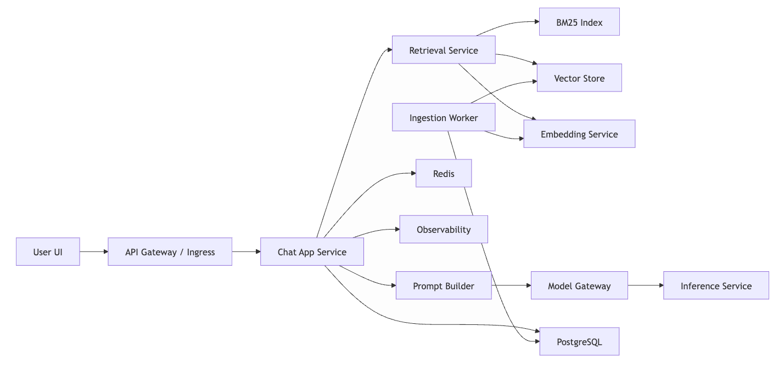

# Production Migration Plan

## Purpose

This repository is currently a proof of concept:

- one local FAQ text file
- one prompt
- one local model
- one Streamlit UI
- no persistence, auth, ingestion pipeline, or production observability

This document describes how to evolve it into a production-ready application, especially if the goal is to:

- replace direct Ollama coupling with your own services
- support multiple documents and larger knowledge bases
- run in a cloud-native environment
- prepare for enterprise-grade reliability, security, and operations

## Current State

The current application flow is:

1. Streamlit accepts a user question.
2. The app loads `docs/faq_real_estate.txt`.
3. The text is chunked locally.
4. BM25 retrieves relevant chunks.
5. A prompt is assembled for the real-estate assistant.
6. A local Ollama model generates the answer.

This is a good POC shape, but it has important limitations:

- only one source document
- no document metadata
- no document versioning
- no user/session persistence
- no authentication or authorization
- no ingestion pipeline
- no audit trail
- no production monitoring
- no separation between UI, orchestration, retrieval, and model serving

## Target Production Architecture

The production architecture should separate concerns into services.

### Core Components

- Frontend
  - customer or internal chat UI
- API gateway / ingress
  - TLS termination, routing, rate limiting, WAF
- Auth layer
  - SSO, OAuth, JWT, RBAC
- Chat application service
  - orchestrates chat, retrieval, prompts, history, citations
- Prompt service or prompt module
  - system prompts, prompt versioning, guardrails
- Retrieval service
  - BM25, vector search, or hybrid search
- Embedding service
  - only needed for vector search
- Vector store
  - optional at first, required for semantic retrieval at scale
- PostgreSQL
  - users, sessions, document metadata, source-of-truth records
- Redis
  - caching, rate limiting, short-lived state
- Document ingestion pipeline
  - parsing, chunking, enrichment, indexing
- Model gateway
  - normalized internal API for model inference
- Inference service
  - your own hosted model backend or external provider wrapper
- Worker/queue system
  - ingestion, reindexing, evaluations, async jobs
- Observability stack
  - logs, metrics, traces, alerting
- Admin/backoffice
  - document upload, approvals, prompt/version management, analytics

## End-to-End Request Chain

The production request path should look like this:

1. User sends a message from the frontend.
2. API gateway validates the request and routes it to the chat service.
3. Auth layer verifies the user and tenant context.
4. Chat service loads session context and policy constraints.
5. Retrieval service fetches relevant content.
6. Prompt builder assembles the system prompt, retrieved context, and user question.
7. Model gateway sends the prompt to the inference service.
8. Inference service returns the model response.
9. Chat service stores history, citations, latency, and feedback metadata.
10. Response is returned to the frontend.
11. Metrics, traces, and logs are emitted across the entire path.

## Recommended Service Chain

## Migration Phases

### Phase 1: Productionize the POC

Goal: keep the current behavior, but make it deployable and maintainable.

Changes:

- extract the chatbot logic out of Streamlit into a backend service
- add a FastAPI API for chat requests and health checks
- keep Streamlit only as a demo or internal UI
- move configuration into environment-based settings
- add structured logging
- add request IDs and correlation IDs
- add basic auth if internal users will access it
- persist chat sessions and feedback in PostgreSQL
- add Redis for caching and rate limiting

Expected outcome:

- the app is no longer a single-process demo
- business logic can be tested independently of the UI
- deployment becomes simpler and safer

### Phase 2: Move from Single FAQ to Multi-Document Search

Goal: support multiple documents instead of one local file.

Changes:

- create a document registry in PostgreSQL
- store document metadata
  - title
  - type
  - source path or object storage path
  - tenant
  - tags
  - version
  - status
  - access policy
- add an ingestion pipeline
  - upload or sync document
  - parse content
  - normalize text
  - chunk content
  - assign metadata
  - index for retrieval
- store chunks separately from document records
- update retrieval to search across all eligible chunks
- return citations with document title and section metadata

Expected outcome:

- the app becomes a real document Q&A system
- retrieval can span many files and document types
- the system can support new content without code changes

### Phase 3: Introduce Vector Search

Goal: improve semantic retrieval quality when the document set grows.

Recommended approach:

- start with hybrid retrieval
  - BM25 for exact and keyword matches
  - vector search for semantic matches
- rerank merged candidates if needed

Infrastructure options:

- PostgreSQL + pgvector
  - best first production choice if you want operational simplicity
- Qdrant
  - good dedicated vector service if retrieval becomes central
- OpenSearch / Weaviate / Milvus
  - consider only if you have stronger search-specific needs

Expected outcome:

- better retrieval for paraphrased questions
- more resilient search across larger and noisier corpora

### Phase 4: Replace Direct Ollama Dependency

Goal: decouple the application from a single local model runtime.

Changes:

- introduce a model gateway inside your architecture
- define a normalized internal model API
  - `POST /chat`
  - `POST /embeddings`
  - `GET /models`
  - `GET /health`
- route model requests through this gateway
- support multiple backends behind the gateway
  - local inference
  - Bedrock
  - vLLM
  - TGI
  - OpenAI-compatible providers

Expected outcome:

- no vendor lock-in
- fallback model routing
- easier cost, latency, and policy control
- no need to change the app when model infrastructure changes

### Phase 5: Enterprise Hardening

Goal: make the system reliable and supportable in production.

Changes:

- auth and role-based access control
- document-level permissions
- audit logs
- prompt versioning
- content approval workflow
- evaluation datasets
- regression testing for retrieval and answer quality
- SLOs and alerting
- autoscaling and health checks
- blue/green or canary deployments

Expected outcome:

- predictable operations
- safer releases
- easier incident response
- measurable quality over time

## Multi-Document Search Design

Moving to multi-document search is the most important functional migration after basic productionization.

### Why the Current POC Will Not Scale

The current approach assumes:

- one file
- one domain
- one implicit source
- no access control

That breaks down quickly when you add:

- multiple FAQs
- policy documents
- market reports
- contracts
- regional documents
- customer-specific knowledge

### Data Model You Will Need

At minimum:

- `documents`
  - id
  - tenant_id
  - title
  - source_uri
  - content_type
  - version
  - status
  - created_at
  - updated_at
- `document_chunks`
  - id
  - document_id
  - chunk_index
  - text
  - token_count
  - metadata_json
- `document_permissions`
  - document_id
  - subject_type
  - subject_id
  - permission
- `chat_sessions`
  - id
  - user_id
  - tenant_id
  - created_at
- `chat_messages`
  - id
  - session_id
  - role
  - content
  - model
  - latency_ms
  - created_at

If vector search is added:

- `chunk_embeddings`
  - chunk_id
  - embedding vector
  - embedding_model
  - embedding_version

### Recommended Retrieval Strategy

For production, use this order:

1. filter documents by tenant and permissions
2. retrieve candidates with BM25 and vector search
3. merge and rerank candidates
4. pass only top context chunks into the prompt
5. return document citations to the user

This gives better recall and more trustworthy responses than a single retrieval method alone.

## Recommended Technology Choices

### First Production Version

- FastAPI for backend API
- PostgreSQL for application data
- Redis for caching and rate limiting
- BM25 retrieval for initial production launch
- your own model gateway
- one inference backend
- OpenTelemetry + Prometheus + Grafana + Sentry

### Next Retrieval Upgrade

- PostgreSQL + pgvector for hybrid retrieval

Why:

- simplest operational model
- one database for relational data and vectors
- good fit for cloud-native environments
- easier migration from the current POC than introducing a separate search stack immediately

## What Should Stay Out of the First Production Release

Avoid trying to do all of this at once:

- advanced agent workflows
- multi-step tool use
- large workflow orchestration
- many model backends on day one
- fully custom admin systems before the chat path is stable

The first production release should prioritize:

- clean service boundaries
- reliable chat responses
- document ingestion
- multi-document retrieval
- auth
- observability

## Practical Migration Order for This Repo

1. Create a FastAPI backend and move chatbot logic into a service module.
2. Keep Streamlit only as an internal test UI.
3. Add PostgreSQL for sessions, document metadata, and audit records.
4. Add a document ingestion pipeline.
5. Support multiple documents and chunk records.
6. Launch production on BM25 retrieval first.
7. Add pgvector and hybrid retrieval when content volume justifies it.
8. Introduce a model gateway so model infrastructure can evolve independently.
9. Add full observability, auth, and release automation.

## Release Readiness Checklist

- backend API separated from UI
- health checks implemented
- config and secrets externalized
- authentication in place
- authorization enforced
- request logging enabled
- traces and metrics enabled
- chat history persisted
- document ingestion automated
- document metadata and permissions stored
- multiple documents searchable
- retrieval quality tested
- model fallback behavior defined
- CI/CD pipeline in place
- rollback plan documented

## Summary

This repository should be treated as the seed of a production system, not the production system itself.

The most important strategic changes are:

- separate UI from backend orchestration
- support multi-document ingestion and retrieval
- store metadata and permissions in a real database
- add vector search only when the corpus size and quality needs justify it
- isolate model serving behind your own internal service boundary

If implemented in that order, the migration path stays practical, incremental, and compatible with the current POC.
